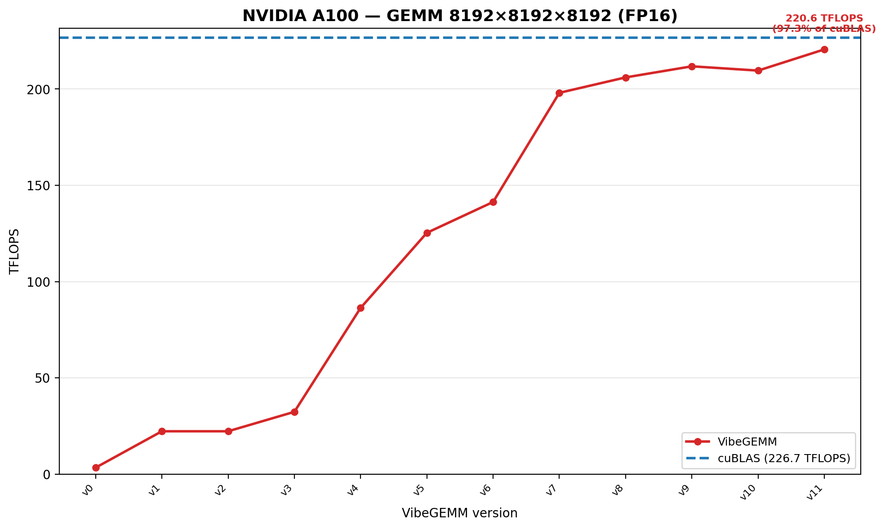
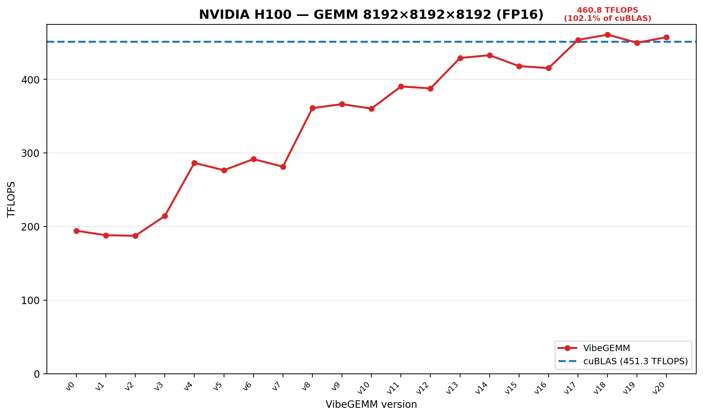

<p align="center">
  
</p>

<p align="center">
  <strong>Knowledge-guided generation of high-performance CUDA GEMM and GEMM-variant kernels</strong>
</p>

<p align="center">
  NVIDIA A100 / SM80 &nbsp;&bull;&nbsp; NVIDIA H100 / SM90-SM90a &nbsp;&bull;&nbsp; CUTLASS-derived GPU knowledge
</p>

# VibeGEMM

VibeGEMM is an LLM-driven framework for constructing high-performance GEMM
backbones and integrating variant-specific CUDA computation. Instead of asking a
model to regenerate an entire kernel through unconstrained trial and error,
VibeGEMM organizes reusable GPU knowledge, restricts exploration with a
hierarchical compatibility graph, refines kernels along ordered trajectories, and
inserts variant logic only where its operands become available.

> **Current repository status**
>
> The knowledge repository, optimization graph, trajectory construction,
> refinement state machine, variant analysis, localization, and transactional
> integration pipeline are implemented and reproducible. VibeGEMM uses
> **Claude Opus 5** for strategy reasoning, CUDA transformation, bounded repair,
> and localized variant integration.

## Highlights

- **Architecture-aware knowledge repository** for SM80 and SM90/SM90a, organized
  into Atom, Tile, Collective, Kernel, and Device levels.
- **2,422 normalized GEMM records** extracted and consolidated from CUTLASS.
- **Hierarchical compatibility graph** covering more than 2.5 million same-level
  unordered record pairs.
- **Trajectory-guided optimization** using maximal cliques, deterministic strategy
  orders, bounded repair, pruning, and rollback.
- **Variant-specific patching** for activation fusion, normalization, dual GEMM,
  quantization, RoPE, and grouped GEMM.
- **Content-addressed provenance** across records, graphs, trajectories, candidates,
  localized patches, and rollback targets.
- **Reference A100 and H100 kernels/results** retained alongside the reconstructed
  generation pipeline.

## System overview

```text
Open-source GPU implementation (CUTLASS)
                    |
                    v
          GPU Knowledge Repository
                    |
                    v
       Hierarchical Optimization Graph
                    |
                    v
 Maximal Cliques -> Ordered Strategy Sequences
                    |
                    v
       Compatible Optimization Trajectories
                    |
                    v
       Progressive Backbone Refinement
                    |
                    v
          Best Validated GEMM Backbone
                    |
                    +---------------- Target Variant + Reference
                    |                            |
                    |                            v
                    |              Variant Analysis / Patch Groups
                    |                            |
                    |                            v
                    +------------------> Patch Localization
                                                 |
                                                 v
                                     Transactional Integration
                                                 |
                                                 v
                                      Final GEMM-Variant Kernel
```

VibeGEMM separates the problem into two phases:

1. **Backbone construction:** identify a strong GEMM implementation while
   preserving validated progress.
2. **Variant integration:** identify computation beyond standard GEMM and inject
   only localized patches without rewriting unrelated backbone structure.

## Performance reference

The following benchmark results use square FP16 GEMM with
`M = N = K = 8192`. The dashed line in each figure is the measured cuBLAS
baseline. Raw latency and throughput measurements are retained with the figures.

### NVIDIA A100

<p align="center">
  
</p>

The A100 series progresses from a naive 3.42 TFLOPS kernel to 220.55 TFLOPS.
The best version reaches **97.3%** of the measured 226.66 TFLOPS cuBLAS baseline.

### NVIDIA H100

<p align="center">
  
</p>

The H100 series progresses from 194.40 TFLOPS to a peak of 460.83 TFLOPS.
The best version reaches **102.1%** of the measured 451.30 TFLOPS cuBLAS baseline.

| GPU | Kernel versions | Best VibeGEMM | cuBLAS | Relative performance |
|---|---:|---:|---:|---:|
| A100 | 12 (`v0-v11`) | 220.55 TFLOPS | 226.66 TFLOPS | 97.3% |
| H100 NVL | 21 (`v0-v20`) | 460.83 TFLOPS | 451.30 TFLOPS | 102.1% |

Raw measurements are available in
[`benchmark_results/perf_a100.txt`](benchmark_results/perf_a100.txt) and
[`benchmark_results/perf_h100.txt`](benchmark_results/perf_h100.txt).

## Repository structure

```text
VibeGEMM-main/
├── knowledge/                    # GPU Knowledge Repository
├── optimization_graph/           # Compatibility and hierarchical graphs
├── backbone_optimization/        # Cliques, sequences, trajectories, refinement
├── variant_patch/                # Analysis, localization, integration
├── tools/knowledge/              # Extraction, normalization, query, validation
├── cutlass-main/                 # Local CUTLASS source tree
├── generated H100 GEMM kernels by VibeGEMM/
│                                  # 62 retained H100 CUDA kernels
├── assets/                       # README visual assets
├── benchmark_results/            # A100/H100 figures and raw measurements
├── LICENSE
└── README.md
```

### Core components

| Component | Responsibility | Current state |
|---|---|---|
| [`knowledge/`](knowledge/) | Store normalized primitives, strategies, parameters, constraints, architectures, and source evidence. | Implemented |
| [`optimization_graph/`](optimization_graph/) | Analyze same-level compatibility and assemble SM80/SM90/SM90a hierarchical graphs. | Implemented |
| [`backbone_optimization/`](backbone_optimization/) | Construct compatible trajectories and progressively refine GEMM backbones with Claude Opus 5. | Implemented |
| [`variant_patch/`](variant_patch/) | Analyze variant operations, localize patch groups, and integrate them transactionally with Claude Opus 5. | Implemented |
| [`tools/knowledge/`](tools/knowledge/) | Reproduce, inspect, query, normalize, and validate the knowledge corpus. | Implemented |

## 1. GPU Knowledge Repository

Each record has the normalized form:

```text
<primitives, strategy, parameters, constraints, architecture, source>
```

Records are stored under:

```text
knowledge/records/<architecture>/<level>/*.json
```

| Record class | Count |
|---|---:|
| Concrete candidates | 2,177 |
| Parameterized methods | 235 |
| Curated seeds | 10 |
| **Total** | **2,422** |

All records under `knowledge/records/` participate in compatibility analysis.
The five levels are:

```text
Atom -> Tile -> Collective -> Kernel -> Device
```

Validate and query the repository:

```bash
python tools/knowledge/validate.py
python tools/knowledge/inventory.py
python tools/knowledge/query.py --architecture sm90a --level atom
python tools/knowledge/query.py --tag warp-specialized --json
```

Extraction tools preview changes by default. Add `--write` only when intentionally
regenerating records from `cutlass-main/`.

## 2. Hierarchical Optimization Graph

VibeGEMM first records incompatible unordered pairs at each architecture/level.
Every omitted pair is treated as compatible by the current preliminary heuristic.
It then constructs one undirected graph per level and assembles the five graphs
into one hierarchical document per architecture.

```text
Pair-wise Compatibility Analysis
              |
              v
   Compatible Level Graphs
              |
              v
Hierarchical Optimization Graph
```

Current graph artifacts contain:

- **2,503,928** analyzed unordered pairs;
- **15** architecture/level compatibility graphs;
- **98,298** compatible edges;
- **3** hierarchical graphs: SM80, SM90, and SM90a.

The graph contains no synthetic cross-level edges and performs no transitive
compatibility inference. Concrete cross-level feasibility is checked during
progressive refinement.

## 3. Trajectory-guided Backbone Optimization

For each level graph, pivoted Bron-Kerbosch enumeration produces maximal cliques.
Each clique becomes deterministic semantic forward/reverse orders. One sequence
from each level is concatenated in Atom-to-Device order.

| Artifact | Count |
|---|---:|
| Maximal cliques | 11,622 |
| Ordered level sequences | 23,244 |
| Stored compatible trajectories | 3,000 |

Enumeration is intentionally budgeted. SM90a Atom currently stores 10,000
maximal cliques and explicitly reports `enumeration_complete: false`. Stored
trajectories use deterministic sampling and retain the full Cartesian-space size.

Progressive refinement applies one record at a time:

```text
latest valid kernel -> generate -> compile/execute -> numerical check -> profile
                               |                                      |
                               +---------- repair / rollback <--------+
```

The state machine implements up to five repairs, a 30% severe-slowdown threshold,
trajectory termination, rollback, and global-best tracking. Claude Opus 5 receives
the latest validated kernel, the selected knowledge record, and validation
diagnostics to generate or repair each localized CUDA transformation.

## 4. Variant-specific Patch Pipeline

The included examples cover:

- GEMM + Bias + GELU;
- GEMM + RMSNorm;
- Dual GEMM + SwiGLU;
- Quantized GEMM;
- GEMM + Permute + RoPE;
- Grouped GEMM + SiLU.

Variant analysis builds an operation DAG, separates standard GEMM from extra
computation, records dtype/layout constraints, and groups connected operations.
Localization maps each group to `mainloop_input_movement`,
`mma_accumulation_loop`, or `epilogue`. Transactional integration keeps the
original backbone immutable and commits a candidate only after all localized
source transitions are hash-consistent.

Current results contain 13 variant-specific operations, 8 semantic patch groups,
24 architecture-specific localizations, and 24 transactional integration traces.

## Requirements

The current offline pipeline requires:

- Python 3.9 or newer;
- no third-party Python dependencies for the validators;
- the included `cutlass-main/` source tree.

A CUDA toolkit or NVIDIA GPU is not required for offline knowledge and graph
construction. Claude Opus 5-driven online generation requires configured model
access; compilation, execution, correctness comparison, and benchmarking require
a compatible CUDA environment and SM80 or SM90/SM90a GPU.

## Validate the checked-in pipeline

Run from the repository root:

```bash
python tools/knowledge/validate.py

python optimization_graph/compatibility_analysis/validate_results.py
python optimization_graph/compatible_level_graph/validate.py
python optimization_graph/hierarchical_optimization_graph/validate.py

python backbone_optimization/maximal_clique/validate.py
python backbone_optimization/ordered_sequence/validate.py
python backbone_optimization/trajectory_construction/validate.py
python backbone_optimization/progressive_refinement/validate.py

python variant_patch/variant_analysis/validate.py
python variant_patch/patch_localization/validate.py
python variant_patch/patch_integration/validate.py
```

Validators check record structure, pair coverage, graph memberships, clique
maximality, sequence permutations, trajectory concatenation, source hashes, state
transitions, rollback targets, and integration hash chains.

## Rebuild generated artifacts

```bash
python optimization_graph/compatibility_analysis/generate_results.py
python optimization_graph/compatible_level_graph/build.py
python optimization_graph/hierarchical_optimization_graph/build.py

python backbone_optimization/maximal_clique/enumerate.py
python backbone_optimization/ordered_sequence/construct.py
python backbone_optimization/trajectory_construction/build.py
python backbone_optimization/progressive_refinement/refine.py

python variant_patch/variant_analysis/analyze.py
python variant_patch/patch_localization/localize.py
python variant_patch/patch_integration/integrate.py
```

Run the corresponding validator after each rebuild. Every downstream result hashes
its direct inputs, so validators reject stale artifacts rather than silently using
inconsistent data.

## Add a new GEMM variant

Create a JSON specification with:

- a stable `variant_id` and supported architectures;
- problem dimensions and representative shapes;
- tensors with dtype and layout requirements;
- an operation DAG with explicit inputs and outputs;
- target outputs;
- reference implementation metadata or a symbolic reference.

Then run:

```bash
python variant_patch/variant_analysis/analyze.py \
  --input path/to/my_variant.json \
  --output-dir variant_patch/variant_analysis/results

python variant_patch/variant_analysis/validate.py
python variant_patch/patch_localization/localize.py
python variant_patch/patch_localization/validate.py
python variant_patch/patch_integration/integrate.py
python variant_patch/patch_integration/validate.py
```

## Claude Opus 5 in the pipeline

Claude Opus 5 is used at the reasoning and code-transformation boundaries:

| Stage | Claude Opus 5 input | Expected output |
|---|---|---|
| Compatibility analysis | Same-level knowledge records and constraints | Incompatible record pairs |
| Backbone refinement | Latest validated CUDA kernel and one trajectory strategy | Localized candidate kernel |
| Bounded repair | Candidate source plus compiler, runtime, or numerical diagnostics | Repaired candidate kernel |
| Patch localization | Variant operation DAG, live values, layouts, and backbone regions | Ranked insertion points |
| Patch integration | Validated backbone, localized patch specification, and invariants | Complete GEMM-variant kernel |

All transformations retain their selected records, prompts, source hashes,
validation decisions, and rollback targets so that a generation run can be audited
and reproduced.

## Roadmap

- provide production deployment profiles for Claude Opus 5;
- expand CUDA compilation, execution, numerical validation, and profiling coverage;
- complete final kernel validation with bounded repair and rollback;
- rebuild the public Python package and stable API;
- add CI for supported Python and CUDA environments;
- extend the knowledge repository to additional high-performance GPU libraries.

## License

VibeGEMM is distributed under the license in [`LICENSE`](LICENSE). CUTLASS and
other referenced upstream material remain subject to their respective licenses.
